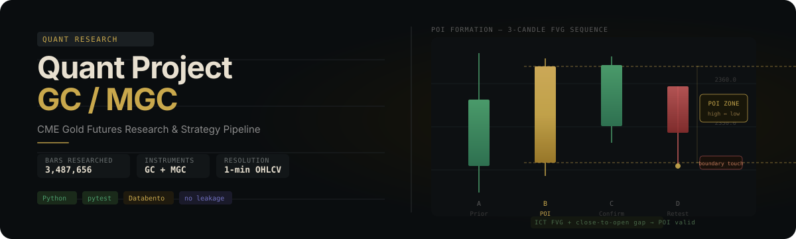
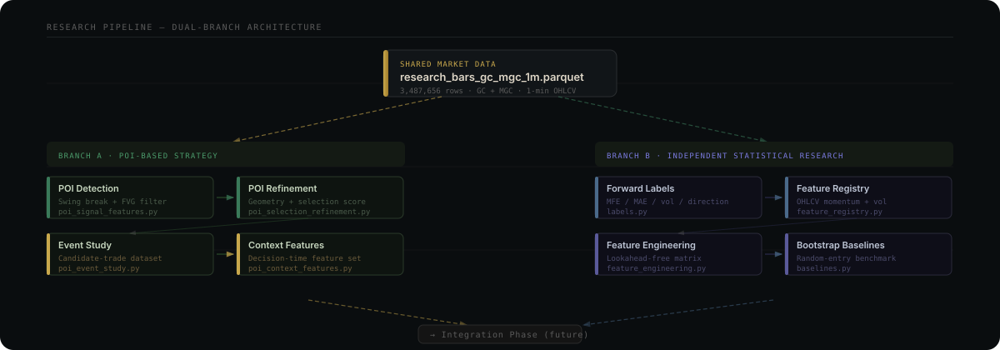

  

  <a href="#project-status">Project status</a> ·
  <a href="#research-architecture">Research architecture</a> ·
  <a href="#getting-started">Getting started</a> ·
  <a href="#running-the-project">Running the project</a> ·
  <a href="#research-governance">Research governance</a>

# Quant Project 1

Quant Project 1 is a systematic intraday research codebase for CME Gold Futures (GC) and Micro Gold Futures (MGC) using Databento one-minute OHLCV data. It converts a discretionary Point of Interest (POI) concept into testable rules while developing a second, deliberately independent statistical-feature research branch.

This repository is a research environment, not a live trading system. It does not contain an approved strategy or production execution. What it does contain is a completed, honestly-reported research program: two independent branches taken through pre-declared contracts, cost-aware sequential backtests, and integration research, ending in defensible rejections.

> **Current decision:** the Phase 2 research program is closed for both branches. The S7P02 continuation-short family — the only policy that ever survived screening — shows a real frictionless event-level edge but was SEQUENTIAL_REJECTED at base costs (Section 8), and every conditioning form in the frozen Section 12B contract (sizing, exits, suppression) failed Validation. Per the authorization memo's linkage the family is **archived** with its evidence chain. Remaining PRD work is engineering: GC-to-MGC transfer validation, prop-firm rules, and forward-test scaffolding. Any new research question requires a fresh pre-declared contract.

## Project at a glance

| Item | Current scope |
|---|---|
| Markets | CME Gold Futures (GC) and Micro Gold Futures (MGC) |
| Signal-research instrument | GC active/front-month continuous series |
| Intended later execution instrument | MGC; transfer validated (FR-09): synchronization excellent, tick-precise entry transfer fails provisionally |
| Source | Databento GLBX.MDP3, one-minute OHLCV bars |
| Source period | 24 May 2021 to 24 May 2026; eligible statistical observations end 22 May 2026 |
| Combined trusted table | 3,487,656 bars: 1,759,671 GC and 1,727,985 MGC |
| Business timezone | `America/New_York`; UTC timestamps remain immutable join keys |
| Research partitions | Development through 2023, Validation in 2024, Final test from 2025 through 22 May 2026 |
| Automated tests | 316 tests across 32 modules |
| Repository state | Research complete for Phase 2; no strategy approved; S7P02 family archived |

## Project status

### Shared foundation

| Phase | Status | Main result |
|---|---|---|
| Data acquisition and validation | Complete | Databento DBN was validated and converted to Parquet |
| Exploratory data analysis | Complete | Contract, liquidity, session, volatility, return, and microstructure research completed |
| Active-contract construction | Complete | Liquidity-based GC/MGC contract schedule and continuous research table created |
| Strategy formalization | Complete | Sessions, POI formation, retest, entry, stop, exit, and invalidation concepts formalized |

The active-contract selector compares the daily volume winner, five-day rolling-volume winner, and previously selected contract. It requires persistence and liquidity dominance before a normal roll, with a separate decisive same-day switch rule. The result is the trusted `research_bars_gc_mgc_1m.parquet` table used by both research branches.

### Branch A — True POI research

| Milestone | Status |
|---|---|
| Baseline POI engine | Complete |
| Structural swing validation | Complete |
| Section 6C refined POI definition and downstream tables | Complete and frozen |
| Section 7R refined event study | Complete; retained as research history |
| Section 7 True POI context, matched controls, first passage, and candidate policies | Complete |
| Section 8 sequential backtest of S7P02 | Complete — **SEQUENTIAL_REJECTED at base costs** |
| Section 12B opportunity conditioning of S7P02 | Complete — **no hypothesis advances; family archived** |

The current Section 7 population contains:

- 7,433 unique True POIs.
- 179,036 unique True POI/retest opportunities.
- 358,072 paired continuation/reversal outcome rows.
- 264 registered decision-time `feat_*` fields.
- 882 New York trading dates.

`S7P02_NY_BEAR_CONT` was the only policy retained as `RESEARCH_ONLY`. Its event-level edge reproduced faithfully in sequential frictionless form (+0.138/+0.117/+0.063 mean R across partitions) but the 2.6-tick base cost load flips every partition negative, and no Section 12B conditioning form (sizing, exits, suppression) survived Validation. The family is archived; it is not approved for trading.

### Branch B — independent statistical research

| Milestone | Status |
|---|---|
| Eligible GC observation frame | Complete |
| Leakage-free fixed-horizon labels | Complete |
| Unconditional/session/time/year baseline behaviour | Complete |
| Controlled feature engineering and registry | Complete |
| Section 7 univariate feature evaluation | Complete |
| Section 8 redundancy and incremental information | Complete |
| Section 9 multivariate research | Complete |
| Section 10 signal construction | Complete |
| Section 11 independent sequential backtest | Complete — **standalone system rejected** |
| Section 12 hybrid integration (gate-filter form) | Complete — **no confirmed incremental value** |
| Section 12B opportunity conditioning (sizing/exits/suppression) | Complete — **no hypothesis advances** |

The statistical branch currently contains:

- 586,530 eligible completed-bar decisions: 219,938 London and 366,592 New York.
- 169-column label output at 5, 15, 30, 60, 120, and 180-minute horizons.
- A 586,530 × 97 feature matrix with 12 audit/join fields and 85 predictors.
- 79 core predictors and 6 explicitly marked experimental hypotheses.
- 37/37 critical feature-production gates passed.
- A completed univariate screen over 83 predictors on Development+Validation only (Final test locked): **0 features advanced for direction; 55 advanced for expansion/opportunity forecasting**; 28 were weak/unstable. Criteria were frozen before computation; results use per-date rank ICs, date-block bootstrap intervals, and Benjamini–Hochberg control.
- A completed redundancy and incremental-information reduction: the 55 advancers collapse into 30 Development-fitted clusters, and anchor-partial-IC testing freezes a **15-feature expansion set** (anchor `atr_20` + 14 confirmed-incremental representatives). The frozen directional set is explicitly empty.
- Completed multivariate benchmarks: the 15-feature ridge model beats the anchor in 3 of 4 session/horizon cells on Validation (IC improvements up to +0.088 with bootstrap intervals above zero); logistic AUCs reach 0.80–0.93. New York 60m probabilities are miscalibrated and flagged for recalibration before sizing use.
- A completed sequential backtest of the honest candidate family (benchmark directions, frozen opportunity gate, declared costs): **all four variants rejected** across 86,353 simulated trades. The standalone statistical system has no directional edge.

Branch B standalone research is closed with a defensible rejection, and both of its carry-forward integration forms have now been tested to completion against Branch A's POI events: the gate-filter form (Section 12) adds no confirmed incremental value, and the conditioning forms (Section 12B: quintile-based sizing, exit-horizon selection, bottom-quintile suppression) all fail Validation under the pre-declared contract. The opportunity model demonstrably forecasts movement magnitude, but no tested use of that forecast survives out-of-sample criteria at realistic costs.

### MLAT book-derived feature research

A separate research line ingests a machine-learning-for-trading textbook (858 pages, 23 chapters, all accounted for once) and derives 12 GC-only candidate features grounded in cited book concepts — Bollinger location and bandwidth, a Cutler RSI variant, Chaikin money flow, Amihud illiquidity, Parkinson and Rogers–Satchell volatility, realized-semivariance balance, a bipower jump ratio, a variance ratio, return-sign entropy, and volatility-of-volatility. Construction is causal and continuity-aware, and evaluation reuses Branch B's governance: Development/Validation only, a frozen contract, per-date rank ICs, Benjamini–Hochberg control, Development-fitted quantile spreads, and incremental information beyond `atr_20` and the frozen 15-feature anchor set.

The v1 result is **0 of 12 features authorized — all `RESEARCH_ONLY`**, failing closed. This is *not* a clean empirical rejection of the raw relationships: the frozen v1 horizon-thinning gate is **structurally non-evaluable** — 0 of 384 required 60/180-minute feature-family-session-partition cells (including 0 Development cells) retain finite thinned daily-IC evidence under the ≥10-observations-per-New-York-date rule, so advancement cannot be authorized. The multivariate authorization gate is consequently CLOSED, and a separately governed audit records the plain GARCH(1,1) implementation as `REJECTED_IMPLEMENTATION`, consistent with Branch B's own boundary/explosive fit. The corrective for a v2 is a gate specification that leaves evaluable evidence at the longer horizons, declared before any recomputation. Full record: `project_docs/mlat_feature_research/mlat_final_research_report.md`.

The line's Sharpe-governance and external-figure additions to the statistical notebook are carried at module level (`performance_diagnostics.py`, `research_figures.py`) but not yet wired into the notebook: their cells anchor on the pre-rewrite GARCH section and need reconciliation with the current GARCH implementation first.

### Execution layer — PRD Phase 4

| Milestone | Status |
|---|---|
| FR-09 GC-to-MGC transfer validation | Complete — **G5_PROVISIONAL_FAIL: tick-precise entry transfer is not safe** |
| FR-10 versioned prop-firm rules engine | Complete — policy layer, evaluation simulator, bootstrap economics estimator |
| FR-11 Rithmic paper integration | Not started — requires credentials and approved platform access |
| Phase 5 shadow-mode forward-test harness | Complete — scaffolding ready; nothing runs because no strategy is approved |

FR-09 measured the 179,036 True POI decision bars against synchronized MGC minutes: coverage and liquidity are excellent (100 percent decision-bar synchronization, median 274 contracts per minute, median basis one tick), but the GC first-contact price trades on MGC in the same minute only 80 percent of the time — stable across all five years. Any future MGC execution mapping therefore needs an MGC-native entry treatment whose cost is measured with real order telemetry, not assumed from bars. Details: `reports/execution/mgc_transfer_validation_summary.md`.

FR-10 provides the prop-firm constraint layer the PRD requires: policies (profit target, daily loss, static/trailing/EOD-trailing drawdown with optional initial-balance cap, consistency share, minimum/maximum days, internal risk buffers) are versioned configuration with effective dates, never strategy code; a deterministic evaluation simulator produces day-by-day ledgers and breach detail; a seeded bootstrap estimates pass probability, breach probabilities, and days-to-pass for any supplied daily P&L distribution. The bundled policies are illustrative templates — real firm terms must be re-verified before use. No strategy claim is attached: the research program has not approved a strategy to feed it.

The Phase 5 shadow-mode harness (`src/execution/shadow_mode.py`) implements the PRD's first forward-test stage as testable infrastructure: a tamper-evident SHA-256 hash-chained decision log, a declared stale-data guard, configuration fingerprinting, and a theoretical-fill reconciler using the same entry-realism rule as the research backtests. `project_docs/forward_test_plan.md` freezes the stage ladder, exit criteria, and the pre-declared sample gate (60 trading days / 100 simulated trades minimum). The preconditions are stated honestly: an approved strategy (none exists — the S7P02 family is archived), Rithmic credentials (FR-11), and a verified prop-firm rule set.

## Research architecture

  

### Branch A: discretionary POI to systematic research

A valid refined POI begins with a three-candle formation inside a swing-breaking displacement:

1. A classic wick-to-wick Fair Value Gap (FVG) must exist.
2. A same-direction close-to-next-open gap must also exist.
3. The FVG must be at least three GC ticks under the frozen default.
4. The confirmation candle must preserve the directionally valid geometry.
5. Standard and expanded cases use their exact Section 6C zone geometry.
6. Duplicate swing-window and break-mode variants are collapsed into one underlying formation.

The reader-facing name **True POI** means the unique refined market formation after variant deduplication. “True” does not mean profitable, validated, or guaranteed to react.

The branch then builds same-day retests, decision-time context, matched non-POI controls, continuation/reversal counterfactuals, stop/target first-passage results, pre-specified interactions, and frozen candidate-policy results.

Primary implementation:

~~~text
src/features/poi_signal_features.py
    Baseline POI, retest, candidate, signal, and structural tables

src/features/poi_selection_refinement.py
    Authoritative Section 6C formation rules and True POI identities

src/features/poi_context_features.py
    Formation, displacement, approach, touch, and market-context features

src/features/poi_first_passage.py
    Ordered entry/stop/target/time-exit path evaluation

src/research/poi_context_event_study.py
    Matched controls, feature studies, interactions, stop/target studies,
    and candidate policy decisions
~~~

The older `poi_event_study.py` and `poi_event_study_refined.py` paths remain for historical reproducibility. They do not supersede the completed True POI context study.

### Branch B: independent statistical discovery

This branch must not load POI identifiers, tables, geometry, rankings, or directional conclusions. It uses only the trusted GC bar history and the controls needed to preserve contract, segment, rollover, liquidity, and session integrity.

Its causal convention is:

~~~text
information cutoff       completed decision bar t
theoretical entry        open of bar t+1
forward path begins      bar t+1
fixed horizons           5, 15, 30, 60, 120, 180 minutes
~~~

Primary implementation:

~~~text
src/statistical_research/labels.py
    Fixed-horizon returns, excursions, ranges, volatility, and classes

src/statistical_research/baselines.py
    Descriptive baseline tables and New York-date block-bootstrap uncertainty

src/statistical_research/feature_registry.py
    Authoritative definitions and metadata for all 85 predictors

src/statistical_research/feature_engineering.py
    Causal, continuity-aware, memory-conscious feature construction

src/statistical_research/feature_validation.py
    Leakage, boundary, numerical, diagnostics, manual-audit, and reload gates

src/statistical_research/mlat_feature_engineering.py, mlat_feature_registry.py,
mlat_feature_evaluation.py, mlat_feature_validation.py, mlat_volatility_models.py,
mlat_artifacts.py
    Book-derived (MLAT) feature research line: GC-only causal construction,
    frozen-contract univariate/incremental evaluation, and artifact persistence

src/statistical_research/performance_diagnostics.py, research_figures.py
    Governed Sharpe diagnostics and the external figure pack (module-level;
    their statistical-notebook wiring is a pending follow-up)
~~~

Branch B will remain independent until feature evaluation, selection, and its own research rules are frozen.

## Locked time and execution rules

| Rule | New York time |
|---|---|
| POI search window | 01:00–12:00 |
| London entry window | [03:00, 06:00) |
| New York entry window | [07:00, 12:00) |
| No-entry gap | 06:00–07:00 |
| New entries stop / True POIs expire | 12:00 |
| Mandatory exit for existing positions | 15:30 |
| Overnight positions | Not allowed |

All session and calendar rules use timezone-aware New York timestamps. Forward paths may not cross New York dates, contracts, continuous segments, invalid rollover boundaries, missing one-minute bars, or the 15:30 forced exit.

## Current research findings

These are research observations, not trading claims:

- True POI retests were modestly better 60-minute expansion locations than state-matched non-POI controls, but the difference was small relative to the common market state.
- Broad continuation shorts were the strongest directional True POI family. A True POI touch is still not an automatic short.
- Broad reversal effects did not survive the final test or ordered execution analysis.
- One-minute OHLCV cannot determine intrabar stop/target order. The leading policies are materially sensitive to conservative, excluded, and optimistic ambiguity treatment.
- In the independent baseline, movement and realized volatility grew approximately with the square root of horizon over the tested grid.
- New York outcomes exhibited materially larger average ranges than London outcomes.
- Signed-return centers were small relative to dispersion, and no weekday filter was approved.
- The completed statistical feature matrix is a candidate inventory, not evidence of prediction.

For exact estimates, sample sizes, and qualification language, use the context reports linked under [Authoritative project documentation](#authoritative-project-documentation).

## Repository layout

~~~text
project-1/
├── assets/readme/                 README visual assets
├── notebooks/exploration/
│   ├── exp1.ipynb                 Main POI notebook; Sections 1–7
│   ├── exp1 appendix.ipynb        Superseded prototype event-study archive
│   └── statistical_feature_research.ipynb
│                                   Independent statistical notebook; Sections 1–6
├── project_docs/                  Strategy specification and project handoffs
├── reports/statistical_research/
│   └── summaries/                 Tracked baseline and feature summaries
├── scripts/                       Full-run and notebook-maintenance utilities
├── src/
│   ├── features/                  POI construction, refinement, context, and paths
│   ├── research/                  True POI research pipeline
│   └── statistical_research/      Independent labels, baselines, and features
├── tests/                         316 synthetic and unit tests
└── .gitignore                     Excludes data, environments, logs, and outputs
~~~

## Getting started

### 1. Obtain repository access

The repository is private. After the project owner adds you as a collaborator:

~~~powershell
git clone git@github.com:Abond1234/project-1.git
Set-Location project-1
~~~

HTTPS cloning also works if your GitHub credentials are configured:

~~~powershell
git clone https://github.com/Abond1234/project-1.git
Set-Location project-1
~~~

### 2. Create a Python environment

Python 3.13 or newer is recommended. The executed primary notebooks currently record Python 3.14.5.

~~~powershell
python -m venv .venv
.\.venv\Scripts\Activate.ps1
python -m pip install --upgrade pip
python -m pip install -r requirements.txt
~~~

On macOS or Linux, activate with `source .venv/bin/activate`.

Install from the committed manifests rather than by naming packages by hand. `requirements.txt` pins the numerical stack to exact versions on purpose: the feature matrix is a frozen research artifact, and its committed Section 6 missingness figures have been observed to differ between NumPy builds on byte-identical input data. A version floor is not enough to make two machines agree. `requirements.lock.txt` records the full frozen environment. The statistical notebook verifies the pinned versions on startup and fails with a clear remedy if they do not match, so a divergent artifact cannot be produced silently.

The environment directory name is a local choice — the notebook accepts any virtual environment located inside the repository, so `.venv` and `.venv-1` both work.

In VS Code, select the repository virtual environment as the Python interpreter so editor diagnostics match the executed environment. Style is enforced with ruff (configuration in `pyproject.toml`); run `python -m ruff check .` and `python -m ruff format .` before committing.

### 2a. Optional GPU acceleration

The project runs fully on CPU and requires no GPU. On a host with an NVIDIA CUDA 12.x device you may additionally install `python -m pip install -r requirements-gpu.txt`; with no GPU array module present the compute backend resolves to CPU automatically and every pipeline, test, and notebook runs unchanged.

`src/compute.py` resolves the backend and reports the host in one line (device, CPU worker count, memory tier, free VRAM). Set `PROJECT_COMPUTE` to override detection:

| Value | Behaviour |
| --- | --- |
| `auto` (default) | CUDA when a working GPU array module is importable, otherwise CPU. |
| `cpu` | Never use the GPU. This is how a CUDA workstation reproduces a CPU-only machine exactly. |
| `gpu` | Require CUDA and fail loudly if it is unavailable, instead of degrading silently. |

Memory, not core count, is the binding constraint the backend plans around: `cpu_worker_count` bounds parallelism by available RAM and memory tier, and `plan_batches` sizes work to free device or host memory so a 4 GB card processes the same workload as a 32 GB host in more, smaller batches rather than by failing.

**Research numerics do not move when a GPU is present.** Floating-point reductions are not associative, so a device scan and a host scan can disagree in the last bits. Frozen research artifacts are therefore computed on the deterministic CPU path regardless of host, and CPU parallelism is used only where the work splits into independent units whose results are unchanged by the split. This is what makes the committed feature matrix identical on a CPU-only laptop and a CUDA workstation.

### 3. Obtain the research data

Raw market data, processed Parquet tables, figures, and large generated reports are intentionally excluded from Git. A clone is sufficient for reading the code and running the unit tests, but not for executing the research notebooks or full pipelines.

Ask the project owner for an authorized artifact handoff or rebuild the data from your own authorized Databento source. Preserve these paths:

~~~text
data/
├── raw/databento/
│   └── glbx-mdp3-20210524-20260524.ohlcv-1m.dbn
└── processed/
    ├── research_bars_gc_mgc_1m.parquet
    ├── section6c_refined_signal_frame_gc.parquet
    └── statistical_research/
        ├── eligible_observations_gc.parquet
        ├── forward_labels_gc.parquet
        └── feature_matrix_gc.parquet
~~~

The raw DBN is needed only when rebuilding from ingestion. The trusted combined research table is the common starting point for current research. Later-stage artifacts are needed only if you want to resume from those completed milestones instead of rebuilding them.

Never commit licensed market data, generated Parquet/CSV output, local virtual environments, credentials, or notebook backup files.

### 4. Run the tests

From the repository root:

~~~powershell
python -m unittest discover -s tests -v
~~~

Current verified result:

~~~text
Ran 316 tests
OK
~~~

The suite uses Python’s standard `unittest` runner; `pytest` is not required. It runs identically with or without a GPU; `PROJECT_COMPUTE=cpu` forces the CPU path if you want to confirm that explicitly.

## Running the project

### Research notebooks

~~~powershell
jupyter notebook notebooks/exploration/exp1.ipynb
jupyter notebook notebooks/exploration/statistical_feature_research.ipynb
~~~

- `exp1.ipynb` is the authoritative POI reader flow. Sections 1–5 cover data, EDA, the research dataset, and strategy formalization; Section 6 contains the frozen refined POI engine; Section 7 contains the completed True POI context research.
- `statistical_feature_research.ipynb` is the independent reader flow through completed Section 6 feature engineering.
- `exp1 appendix.ipynb` is a legacy prototype archive, not the current source of conclusions.

Both primary notebooks are checked in with every code cell executed and no saved error outputs. Full execution requires the ignored data artifacts and substantially more time and memory than the unit tests.

### POI pipeline scripts

Run scripts from the repository root:

| Command | Purpose | Status |
|---|---|---|
| `python scripts/run_section6c_refinement.py` | Rebuild refined POIs, retests, candidates, validation, and visual audits | Current Section 6 definition |
| `python scripts/run_section7r_event_study.py` | Reproduce the refined event-study baseline | Historical bridge to current Section 7 |
| `python scripts/run_section7_poi_context_research.py` | Rebuild True POI context, labels, matched controls, interactions, first passage, and candidate policies | Current authoritative Section 7 |
| `python scripts/run_section7_event_study.py` | Reproduce the original structural event study | Legacy only |

The current Section 7 runner accepts `--start-date`, `--end-date`, `--skip-stop-target`, and `--force-chunks` for scoped or diagnostic runs. Memory handling is adaptive: the runner measures machine memory at start and runs single-pass when the estimated peak (about 4 GB for the full population) fits, or falls back to chronological whole-day chunked processing otherwise, so the full pipeline completes on 8 GB machines. Chunked output is verified value-identical to single-pass. Machines with 16 GB or more normally run every stage single-pass. Treat these scripts as research pipelines, not lightweight examples.

The `update_*_notebook.py` and `reorganize_exp1_sections.py` scripts intentionally rewrite notebook structure. They are maintenance/migration utilities and should be run only when the corresponding notebook edit is part of an approved change.

### Statistical pipeline

The current statistical workflow is notebook-driven:

1. Load `data/processed/research_bars_gc_mgc_1m.parquet`.
2. Validate the GC-only eligible observation frame.
3. Build fixed-horizon labels without shortening unavailable paths.
4. Build and save baseline behaviour tables.
5. Build all 85 registered features on the full causal GC history.
6. Map completed decision-bar features to the eligible frame.
7. Run production validation, diagnostics, manual reconstruction, and save/reload gates.

Do not start Section 7 feature evaluation by changing frozen Section 6 definitions in response to Final-test behaviour.

## Generated artifacts

Generated artifacts are excluded from Git and should be rebuilt or transferred separately.

### Main shared table

~~~text
data/processed/research_bars_gc_mgc_1m.parquet
~~~

This table contains the selected active contract, UTC/New York timestamps, product and contract identity, continuous-segment identity, tradability and rollover controls, and reusable bar fields.

### Current POI artifacts

~~~text
data/processed/section6c_refined_poi_table_gc.parquet
data/processed/section6c_refined_retest_table_gc.parquet
data/processed/section6c_refined_candidate_trade_table_gc.parquet
data/processed/section6c_refined_signal_frame_gc.parquet

data/processed/section7_true_poi_context_frame_gc.parquet
data/processed/section7_true_poi_outcome_labels_gc.parquet
data/processed/section7_true_poi_feature_study_summary_gc.parquet
data/processed/section7_true_poi_interaction_summary_gc.parquet
data/processed/section7_true_poi_stop_target_summary_gc.parquet
data/processed/section7_true_poi_candidate_ranking_gc.parquet
data/processed/section7_true_poi_backtest_candidate_registry_gc.parquet
data/processed/section7_true_poi_location_quality_summary_gc.parquet
~~~

### Current statistical artifacts

~~~text
data/processed/statistical_research/eligible_observations_gc.parquet
data/processed/statistical_research/forward_labels_gc.parquet
data/processed/statistical_research/baseline_summary_gc.parquet
data/processed/statistical_research/baseline_cost_thresholds_gc.parquet
data/processed/statistical_research/feature_matrix_gc.parquet
data/processed/statistical_research/feature_registry_gc.parquet
data/processed/statistical_research/feature_validation_gc.parquet
data/processed/statistical_research/feature_diagnostics_gc.parquet
data/processed/statistical_research/feature_reference_parameters_gc.parquet
~~~

Tracked summaries under `reports/statistical_research/summaries/` provide a lightweight view of completed statistical milestones without distributing the underlying data.

## Test coverage

| Test module | Tests | Main contract |
|---|---:|---|
| `test_poi_selection_refinement.py` | 29 | Exact FVG/gap geometry, tick safety, thresholds, lineage, and non-destructive saves |
| `test_poi_first_passage.py` | 10 | Entry, stop/target order, ambiguity, forced exits, contract/segment boundaries |
| `test_poi_event_study.py` | 7 | Horizon handling, canonical populations, summaries, and visual-audit outputs |
| `test_poi_context_features.py` | 6 | Availability timing, True POI identity, deduplication, and entry-model gating |
| `test_poi_sequential_backtest.py` | 6 | POI chronological account state, costs, and rejection paths |
| `test_poi_context_event_study.py` | 2 | Direction mapping and Development-bin reuse |
| `test_poi_signal_features.py` | 2 | Baseline POI construction and structural annotation |
| `test_statistical_research_labels.py` | 20 | Fixed paths, availability reasons, tick grid, outcomes, and Development-only thresholds |
| `test_statistical_research_feature_evaluation.py` | 18 | Univariate screening, BH control, Development-only binning, and shortlist gates |
| `test_statistical_research_features.py` | 14 | Causality, resets, references, registry, dtypes, and diagnostics |
| `test_statistical_research_backtest.py` | 13 | Sequential fills, daily limits, forced exits, and cost scenarios |
| `test_statistical_research_multivariate.py` | 12 | Fold discipline, anchor comparison, and metric reproducibility |
| `test_statistical_research_redundancy.py` | 10 | Correlation clustering and incremental-information gates |
| `test_statistical_research_signals.py` | 8 | Versioned signal configuration and construction rules |
| `test_statistical_research_calibration.py` | 5 | Isotonic recalibration fitted on Development only |
| `test_statistical_research_baselines.py` | 4 | Availability-aware aggregation, cost hurdles, date counts, and bootstrap reproducibility |
| `test_compute.py` | 24 | Device override, forced-CPU reproduction, memory-aware batching, order-preserving parallelism |
| `test_garch_volatility.py` | 12 | Development-only fitting, forward recursion, and direct leakage assertions |
| `test_hybrid_integration.py` | 11 | Section 12 gate-filter population and identity join |
| `test_prop_firm_rules.py` | 11 | Drawdown types, consistency blocks, buffers, and evaluation outcomes |
| `test_resources.py` | 11 | Memory tiering, chunk planning, and chronological chunk integrity |
| `test_opportunity_conditioning.py` | 10 | Section 12B planted effects proving each pass and veto path |
| `test_feature_window_determinism.py` | 8 | Rolling-window oracle, group-key integrity, device independence |
| `test_shadow_mode.py` | 8 | Hash-chain integrity, tamper detection, stale data, fill reconciliation |
| `test_mgc_transfer.py` | 7 | Coverage, tick-exact basis, containment, and provisional verdict paths |
| `test_mlat_volatility_models.py` | 12 | MLAT forward realized-volatility recursion, run boundaries, and GARCH audit |
| `test_mlat_feature_evaluation.py` | 11 | MLAT univariate/incremental evaluation, BH, quantiles, thinning, and verdict gates |
| `test_mlat_feature_engineering.py` | 6 | MLAT causal construction, boundary resets, zero-denominator honesty, and GC scope |
| `test_mlat_feature_validation.py` | 6 | MLAT matrix validation, overlap audit, deterministic sample hash, and reload gates |
| `test_performance_diagnostics.py` | 6 | Governed feature-spread and backtest daily-R Sharpe diagnostics |
| `test_mlat_feature_registry.py` | 5 | MLAT registry definitions, metadata, and validation bounds |
| `test_mlat_artifacts.py` | 2 | CSV round-trip null/empty distinction and reserved-token rejection |
| **Total** | **316** | across 32 modules |

## Research governance

### No-lookahead contract

- Decision features end at completed bar `t`.
- Entry-bar OHLCV belongs to the future for next-bar entry research.
- Touch-close features may be used only with a next-bar confirmation entry, never a same-bar boundary entry.
- Fixed-horizon labels start at bar `t+1` and are marked unavailable rather than shortened.
- Development-fitted thresholds, bins, and time-of-day references are reused unchanged out of sample.

### Chronological governance

- **Development:** through 31 December 2023.
- **Validation:** calendar year 2024.
- **Final test:** 1 January 2025 through 22 May 2026.

The Final test has already had limited descriptive exposure in the completed baseline and candidate-policy work. It must not be described as completely unseen, and later definitions must not be tuned to those exposed values.

### Statistical interpretation

- Overlapping minute observations are correlated event rows, not independent trades.
- MFE is not realized profit, MAE is not realized loss, and range is not a tradable return.
- Raw swing/break variants are correlated representations; headline True POI estimates use deduplicated formations and retests.
- Date-block bootstrap intervals use New York trading dates as the dependence unit.
- A positive subgroup mean is insufficient without sample size, date coverage, Development-to-Validation consistency, tail behaviour, friction-aware magnitude, and interpretability.

### Current implementation boundaries

- One-minute OHLCV cannot resolve intrabar event order.
- OHLCV volume is not aggressor flow, queue state, or market depth.
- Event-level first-passage results are not a sequential portfolio backtest.
- Re-entry, overlapping-position sequencing, costs, slippage, commissions, sizing, and capital constraints remain unimplemented.
- GC-to-MGC signal/execution mapping remains a later validation phase.
- Final-test rows are disproportionately concentrated in 2025–2026 for the True POI population.

## Authoritative project documentation

Read these in order when joining the project:

1. [POI project context and milestone history](<project_docs/Quant Project 1 — Context Report 23-06-2026.md>) — the final “Authoritative” sections override older progress entries retained for traceability.
2. [Independent statistical research context](project_docs/statistical_feature_research_context_report.md) — complete research contract and current Branch B handoff.
3. [GC/MGC POI strategy specification](project_docs/gc_mgc_poi_strategy_spec_v0_2_appended_v0_2A.txt) — discretionary-to-systematic strategy source specification.
4. [Section 4 research-dataset report](<project_docs/Section 4 Follow-up Report - Research Dataset Outputs.md>) — active-contract construction and trusted table details.
5. [Section 5 baseline summary](reports/statistical_research/summaries/section5_baseline_summary.md) and [Section 6 feature summary](reports/statistical_research/summaries/section6_feature_engineering_summary.md) — concise tracked statistical results.

## Contributor workflow

For collaborative work:

1. Pull the latest `main` before starting.
2. Use a short-lived branch for a coherent research or engineering milestone.
3. Keep changes scoped; never use `git add -A` in a mixed working tree.
4. Run the 94-test suite and any relevant full-run validation.
5. Review notebook outputs, schemas, row counts, null behaviour, and research conclusions.
6. Update the relevant context report when a milestone changes project state.
7. Open a pull request with the research question, definitions, artifacts, checks, and limitations.

Do not commit raw/processed market data, generated figures and tables, virtual environments, caches, secrets, API keys, or local logs. The `.gitignore` is part of the project’s data-governance boundary.

## License and data notice

No open-source license is currently included. This is a private research repository; do not redistribute its code or data without the project owner’s approval. Databento market data is not included and must be accessed under the contributor’s or project’s authorized data arrangement.

Nothing in this repository is investment advice or an instruction to trade.
